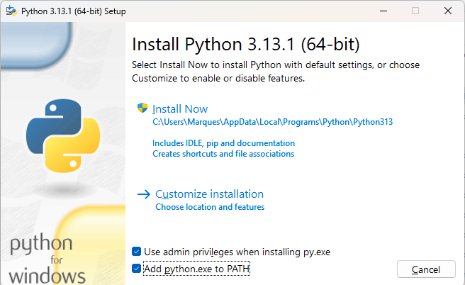
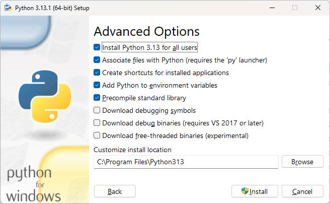

# python-treinamento

Repositório criado para aprendizado da linguagem Python

# Preparação da máquina do desenvolvedor

Instalar na máquina de desenvolvimento:

1 - Python (https://www.python.org/downloads/)
2 - Visual Studio Code (https://visualstudio.microsoft.com/pt-br/)
3 - Git (https://git-scm.com/)
4 - Dbeaver - https://dbeaver.io/download/
5 - Modelio UML (https://www.modelio.org/index.htm)
6 - Postgtres (https://www.enterprisedb.com/downloads/postgres-postgresql-downloads) - Pelo menos o Cliente e se instalar o banco não deixe de instalar o postgis
7 - Instalar o vistualstudio (https://visualstudio.microsoft.com/pt-br/visual-cpp-build-tools/)

Ainda, criar conta no site github (https://github.com/)

# Instalação do Python

Realizar a instalação do Python para todos os usuários da máquina





Instalar o virtualenv em um prompt com permissão de administrator
```cmd
pip install virtualenv
```

Executar o comando abaixo no powershell com permissão de administrator


```powershell
Set-ExecutionPolicy -Scope LocalMachine -ExecutionPolicy RemoteSigned
```