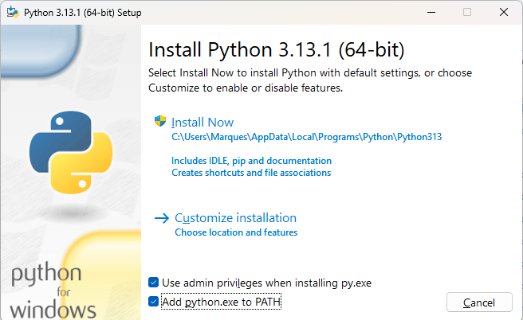
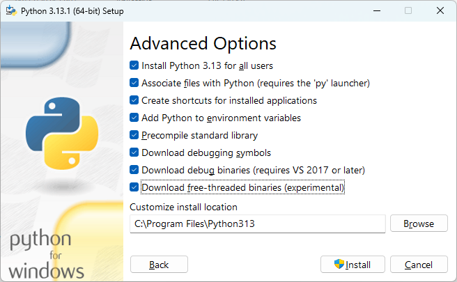
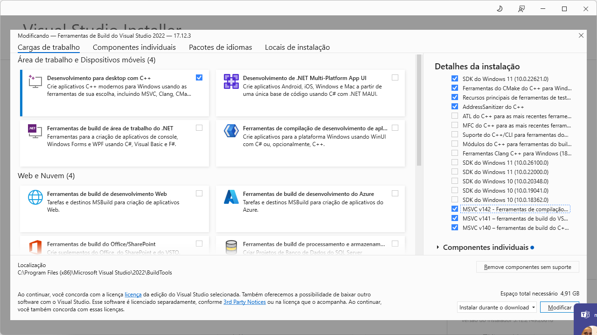

# python-treinamento

Repositório criado para aprendizado da linguagem Python

## Preparação da máquina do desenvolvedor

Criar conta no site github (https://github.com/)

Instalar na máquina de desenvolvimento:

1 - Python (https://www.python.org/downloads/) *Durante a instalação seguir as orientações do próximo tópico*

2 - Visual Studio Code (https://visualstudio.microsoft.com/pt-br/)

3 - Git (https://git-scm.com/)

4 - Dbeaver - https://dbeaver.io/download/

5 - Modelio UML (https://www.modelio.org/index.htm)

Para adicionar o suporte para postgres no Python do Windows é necessário instalar o cliente do postgres e as bibiliotecas de compilação do c++

6 - Postgtres (https://www.enterprisedb.com/downloads/postgres-postgresql-downloads) - Pelo menos o Cliente e se instalar o banco não deixe de instalar o postgis

7 - Instalar o VisualStudio 2022 (https://visualstudio.microsoft.com/pt-br/visual-cpp-build-tools/)

8 - WSL com Docker (https://github.com/codeedu/wsl2-docker-quickstart)


## Instalação do Python

Para realizar a instalação do Python para todos os usuários da máquina, durante a instalação, marque as opções indicadas nas imagens abaixo:





Instalar o virtualenv em um prompt com permissão de administrator
```bash
pip install virtualenv
```

Executar o comando abaixo no powershell com permissão de administrator

```powershell
Set-ExecutionPolicy -Scope LocalMachine -ExecutionPolicy RemoteSigned
```

## Instalação do Visual Studio 2022

Para conseguir realizar a integração do Python com o postgres no Windows é necessário realizar a instalação das ferramentas de compilação C++ do VisualStudio Community 2022. Para isso selecione os seguintes pacotes.

Marque os pacotes indicados na imagem abaixo:

